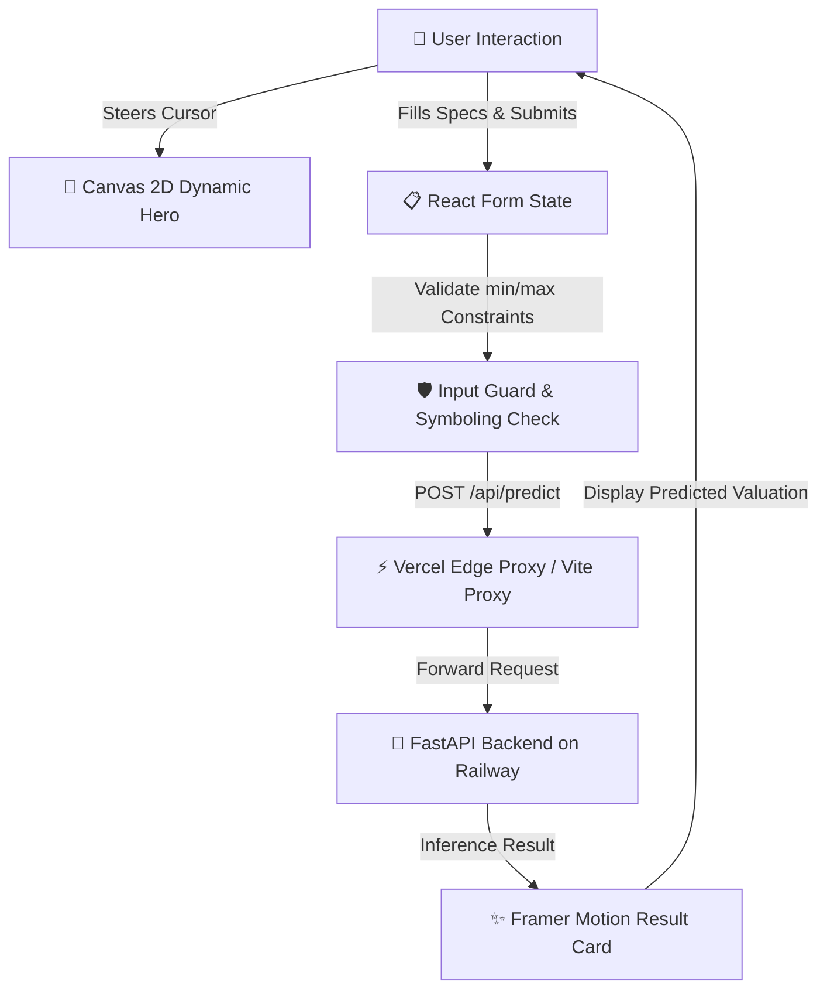

<div align="center">

# 🚗 AutoValue AI - Modern Frontend Application

[](https://car-price-predictor-front-end.vercel.app)
[](https://react.dev/)
[](https://www.typescriptlang.org/)
[](https://vitejs.dev/)
[](https://www.framer.com/motion/)

<p align="center">
  A high-performance, responsive AI vehicle valuation platform featuring dynamic physics-based canvas animations, smart form validation, and real-time machine learning predictions.
</p>

[Explore Live Web App ↗](https://car-price-predictor-front-end.vercel.app) · [Backend API Repository ↗](https://github.com/seif-a096/car-price-predictor) · [Report Bug ↗](https://github.com/seif-a096/car-price-predictor/issues)

</div>

---

## 📸 Overview

**AutoValue AI Frontend** is a modern React 19 + TypeScript web application built with Vite. It connects users directly to a trained regression inference pipeline hosted on Railway, presenting vehicle attributes in a clean, categorized glassmorphic interface and rendering a custom 60 FPS Canvas 2D engine.



---

## 🛠️ Tech Stack & Architecture

| Technology               | Purpose                                                                           |
| :----------------------- | :-------------------------------------------------------------------------------- |
| **React 19**             | Component-driven UI architecture and declarative state management                 |
| **TypeScript 5**         | Strict end-to-end type safety across request payloads and configs                 |
| **Vite 6**               | Lightning-fast development server, HMR, and optimized production bundler          |
| **Framer Motion**        | Micro-interactions, spring transitions, and result card entrance animations       |
| **Canvas 2D Engine**     | Custom 60 FPS interactive physics simulation, lighting shaders, and celestial sky |
| **Vercel Edge Rewrites** | Zero-latency API reverse proxy eliminating cross-origin (CORS) preflight issues   |

---

## ✨ Key Features

### 1. 🕹️ Interactive Cursor-Synced Vehicle Dynamics

- **Lane-Glide Physics**: Moving the cursor across the hero graphic glides the car horizontally across the highway lanes.
- **Dynamic Steering Roll**: Calculates velocity differentials to tilt the vehicle chassis naturally into turns.
- **Taillight Ground Glow Tracking**: OLED taillight reflections, spot glows, and road reflections seamlessly move in real time with the vehicle.
- **Parallax Starfield**: The crescent moon, horizon glow, and twinkling stars shift with subtle inverse parallax for 3D depth.
- **Spring Auto-Centering**: Smoothly eases back to the center highway lane when the cursor leaves the canvas.

### 2. 🌙 Astronomical Night Sky Engine

- **3D Crescent Geometry**: Built with accurate mathematical ellipse and arc projections modeling true spherical light wrapping.
- **Ambient Moonlight Diffusion**: Multi-stage inverse-square atmospheric glow that seamlessly fades to pure black without hard edges or artificial rings.
- **Multi-Spectral Twinkling Stars**: Procedural stars with distinct spectral temperatures (warm amber, cool cyan, diamond white).

### 3. 🛡️ Smart Form Validation & Categorized Fields

- **Categorized Groups**: Organized into _Vehicle Identity_, _Risk & Insurance_, _Dimensions_, _Engine Specs_, and _Performance_.
- **Pre-filled Defaults**: Defaults derived from dataset averages allow instant one-click estimates.
- **Symboling (Risk Rating) Bounded**: Strictly bounds input between `[-3, 3]` to prevent extreme inputs from distorting model outputs.
- **Positive Bounds**: Automatic guards (`min: 0`) on dimensions, weight, displacement, and RPM.

### 4. ⚡ Seamless Proxy & Zero-CORS Architecture

- In local development, requests route through Vite's internal proxy server (`/api/predict` → Railway).
- In production, Vercel Edge Rewrites (`vercel.json`) proxy API calls server-to-server, bypassing browser preflight restrictions.

---

## 📁 Project Structure

```text
front-end/
├── public/
│   ├── favicon.svg          # Custom neon AI sports car vector favicon
│   └── realistic-car.jpg    # High-resolution vehicle graphic asset
├── src/
│   ├── components/
│   │   ├── FieldGroup.tsx    # Collapsible / organized form field categories
│   │   ├── FormField.tsx     # Custom glassmorphic inputs & custom dropdowns
│   │   ├── HeroGraphic.tsx   # 60 FPS Canvas 2D interactive vehicle engine
│   │   └── ResultCard.tsx    # Animated valuation card with price formatter
│   ├── api.ts               # Resilient fetch client with error handling
│   ├── App.tsx              # Main application layout, hero, form, & footer
│   ├── fieldConfig.ts       # Full configuration, defaults, and validation bounds
│   ├── index.css            # Custom CSS tokens, glassmorphism, & dark mode theme
│   ├── main.tsx             # React DOM root mounting
│   └── types.ts             # TypeScript interfaces for API & form configs
├── index.html               # Entry HTML with Google Fonts & SEO tags
├── package.json             # Scripts and dependencies
├── tsconfig.json            # Strict TypeScript configuration
├── vercel.json              # Edge proxy & SPA rewrite rules
└── vite.config.ts           # Vite bundler & local dev server proxy settings
```

---

## 🚀 Getting Started Locally

### Prerequisites

- **Node.js**: v18.0.0 or higher
- **npm** or **pnpm**

### Installation

1. **Clone the repository**:

   ```bash
   git clone https://github.com/seif-a096/car-price-predictor.git
   cd car-price-predictor/front-end
   ```

2. **Install dependencies**:

   ```bash
   npm install
   ```

3. **Start the local development server**:

   ```bash
   npm run dev
   ```

   Open [http://localhost:5173](http://localhost:5173) in your browser.

4. **Build for production**:
   ```bash
   npm run build
   ```

---

## 🌐 Production Deployment

The frontend is deployed on **Vercel** with automatic CI/CD.

```json
{
  "rewrites": [
    {
      "source": "/api/predict",
      "destination": "https://car-price-predictor-production-fdec.up.railway.app/predict"
    },
    {
      "source": "/(.*)",
      "destination": "/index.html"
    }
  ]
}
```

---

## 📄 License

This project is licensed under the MIT License - see the [LICENSE](LICENSE) file for details.

© 2026 **AutoValue AI**. Developed by [Seif](https://github.com/seif-a096).
